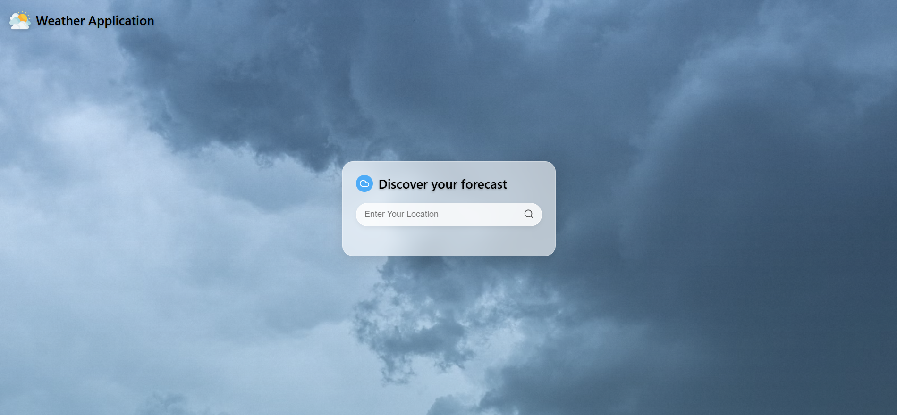
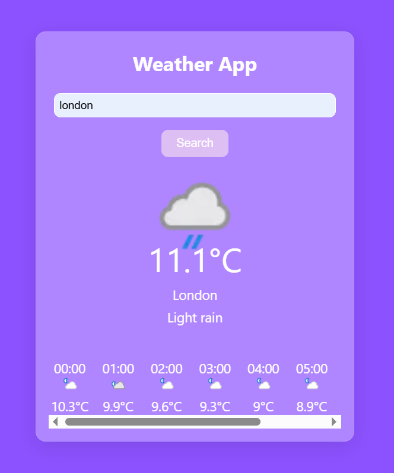

# 🌦️ Weather Forecast App

**Weather Forecast App** is a responsive and interactive web application that provides current weather conditions and hourly forecasts for any city around the world.  
It utilizes the [WeatherAPI](https://www.weatherapi.com/) and includes beautiful icons, clean animations, and a simple user experience.

---

## 🌟 Features

- 🔍 Search for any city to get real-time weather updates
- 🌡️ Displays temperature, humidity, wind speed, and conditions
- 🕐 Shows next 8 hours of forecast with custom weather icons
- 🎨 Icon mapping for a wide range of weather conditions
- 📱 Responsive UI for desktop and mobile screens

---

## 🛠️ Tech Stack

- **Frontend:** HTML5, CSS3, JavaScript (Vanilla)
- **API:** [WeatherAPI](https://www.weatherapi.com/)

---

## 🚀 Getting Started

To run the project locally:

1. **Clone the repository:**

    ```bash
    git clone https://github.com/yourusername/weather-forecast-app.git
    cd weather-forecast-app
    ```

2. **Add your API key:**

    - Open `script.js`
    - Replace the existing API key with your own from [WeatherAPI](https://www.weatherapi.com/)

    ```javascript
    const apiKey = 'YOUR_API_KEY_HERE';
    ```

3. **Open the app:**

    Open `index.html` directly in your browser:

    ```bash
    open index.html
    ```

---

## 📷 Screenshots

### 🔍 City Search and Current Weather  


### 🕒 Hourly Forecast  


---

## 📂 Project Structure

```text
weather-forecast-app/
├── index.html         # Main webpage
├── styles.css         # Styling and animations
├── script.js          # Weather logic and API handling
├── weather1.png
├── weather2.png    
└── README.md
